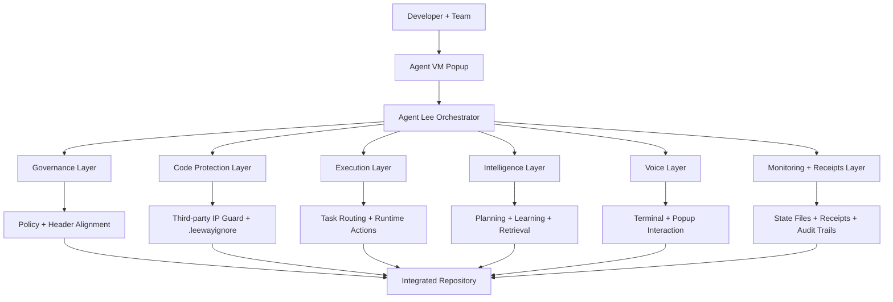
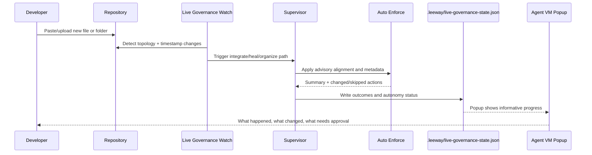
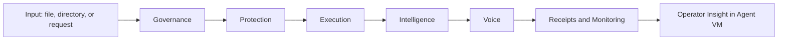

/*
LEEWAY HEADER — DO NOT REMOVE

REGION: UTIL
TAG: UTIL.TRAINING.LEEWAY_STANDARDS_2_WEEK_BOOK.MAIN
DESCRIPTION: Complete two-week training course and onboarding book for LeeWay Standards SDK adopters
AUTHORITY: LeeWay-Standards
DISCOVERY_PIPELINE: Voice → Intent → Location → Vertical → Ranking → Render

5WH:
WHAT = LeeWay Standards 2-Week Training Book
WHY = Deliver a complete, practical learning path for developers and teams adopting LeeWay Standards and agent society architecture
WHO = Leeway Innovations / Agent Lee Enablement
WHERE = LEEWAY_STANDARDS_2_WEEK_TRAINING_BOOK.md
WHEN = 2026-04-21
HOW = Structured curriculum, architecture visuals, lab guides, and assessment rubrics

CHAIN: Standards → Integrated → Runtime → Projections
LICENSE: PROPRIETARY
*/

# LeeWay Standards 2-Week Training Book

## Audience and Promise
This course is for developers, architects, and engineering managers who want to adopt LeeWay Standards without losing their existing coding style, stack, or delivery speed.

By the end of two weeks, learners can:
- Install the SDK from GitHub and activate it safely.
- Build a layered agent society similar to the LeeWay Agent Society model.
- Operate governance, code protection, execution, intelligence, and voice layers together.
- Keep LeeWay advisory-first so it enhances developer output and never blocks delivery.
- Ship to mainstream platforms and hosts without CI/CD failures caused by standards tooling.

---

## Part I: Why LeeWay Exists Right Now (AI Era Context)

### The current AI engineering reality
Modern teams are now shipping with:
- Human-written code + AI-generated code in the same repository.
- Many small assistants, scripts, and autonomous workflows.
- Fast experimentation cycles that can drift architecture over time.

This creates five recurring risks:
1. Drift risk: code quality and conventions diverge rapidly.
2. Safety risk: generated code bypasses expected architecture controls.
3. Traceability risk: no clear receipt of why code changed.
4. Coordination risk: multiple agents overlap responsibilities.
5. Delivery risk: strict policy tools break CI/CD and block teams.

### LeeWay response model
LeeWay Standards solves this with an advisory, layered operating model:
- Governance without tyranny.
- Structure without blocking creativity.
- Autonomy with permission gates for sensitive operations.
- Standards that augment existing company design systems rather than replacing them.

### Non-blocking doctrine
LeeWay is designed to be enhancement-first:
- It should suggest, align, and protect.
- It must not forcibly rewrite third-party IP.
- It must not break developer commit, merge, or deployment pipelines.

---

## Part II: LeeWay Order (Mental Model)

### Core idea
LeeWay Order is the execution discipline that keeps all agents and layers aligned to one principle:

Reliable autonomy under developer sovereignty.

### LeeWay Order principles
1. Developer sovereignty: developers own final authority.
2. Advisory-first governance: standards guide, not gate.
3. Layered responsibilities: each layer has a bounded role.
4. Explicit permission boundaries: sensitive actions require approval.
5. Continuous intake: new files and directories are integrated automatically.
6. Observable operation: every major action emits state and receipts.

---

## Part III: Layered Architecture Visuals

## Visual 1: Full Agent Society Stack


## Visual 2: Continuous New File and New Directory Intake


## Visual 3: Layer Workflow in Practice


---

## Part IV: Getting the SDK from GitHub and Bootstrapping

### Step 1: Clone and install
```bash
git clone <your-fork-or-upstream-url>
cd LeeWay-Standards
npm install
```

### Step 2: Setup a target repo
```bash
npm run setup -- --root "<path-to-target-repo>"
```

Expected outcomes:
- Creates and updates .leeway runtime manifests.
- Installs advisory git hooks if .git exists.
- Aligns governed metadata.
- Leaves delivery unblocked.

### Step 3: Start continuous integration loop
```bash
npm run watch -- --root "<path-to-target-repo>"
```

### Step 4: Work through Agent Lee terminal
```bash
npm run agentlee
```

Common interactive actions:
- /status
- /organize
- /organize --approve
- /build-layer governance
- /build-layer learning
- /build-layer healing
- /build-layer discovery
- /create-agent MyAgent
- /reproduce-agent ExistingPattern
- /redesign-agent LegacyAgent

---

## Part V: Two-Week Curriculum (Detailed)

## Week 1: Foundations and Controlled Adoption

### Day 1: Orientation and AI-era problem framing
Learning goals:
- Understand why standards need to be agent-ready.
- Distinguish blocking governance from advisory governance.

Labs:
- Read this training book front to back once.
- Map your current workflow to the five AI-era risks.

Deliverable:
- One-page team risk map with current pain points.

### Day 2: Installation and first setup
Learning goals:
- Download from GitHub.
- Run setup and inspect outputs.

Labs:
- Clone SDK.
- Run setup on a sandbox repository.
- Open .leeway/developer-runtime.json and .leeway/agents.manifest.json.

Deliverable:
- Setup receipt and screenshot/log of successful setup.

### Day 3: Governance fundamentals
Learning goals:
- Learn metadata alignment logic.
- Understand what is advisory vs permission-gated.

Labs:
- Run compliance and align flows.
- Observe advisory output without breaking local development.

Deliverable:
- Before/after compliance summary.

### Day 4: Protection and external code respect
Learning goals:
- Protect third-party code and external licenses.
- Configure .leewayignore for local policy.

Labs:
- Add test paths to .leewayignore.
- Insert a third-party header marker in a sample file and validate skip behavior.

Deliverable:
- Repo-level protection policy snippet.

### Day 5: Agent VM and operator interface
Learning goals:
- Use Agent VM as the main interaction popup.
- Learn progress narration patterns for Agent Lee.

Labs:
- Open Agent VM.
- Trigger at least three commands and record operator-facing status updates.

Deliverable:
- Agent VM interaction log with command/result mapping.

---

## Week 2: Agent Society Engineering and Capstone

### Day 6: Agent society design
Learning goals:
- Design a multi-agent topology with clear responsibilities.
- Avoid role overlap and coordination dead zones.

Labs:
- Define at least five agent roles:
  - Governance Guardian
  - Runtime Healer
  - Learning Keeper
  - Execution Conductor
  - Spatial or Voice Operator

Deliverable:
- Agent responsibility matrix.

### Day 7: Layer provisioning and integration
Learning goals:
- Build all core layers and wire them coherently.

Labs:
- Provision governance, learning, healing, and discovery layers.
- Validate expected directories and manifests.

Deliverable:
- Layer provisioning report with paths and readiness status.

### Day 8: Continuous intake (proactive + reactive)
Learning goals:
- Ensure file and directory introductions are automatically integrated.

Labs:
- Create one new folder and one new code file while watch is running.
- Confirm integration results in live governance state and receipts.

Deliverable:
- Intake event evidence with state snapshots.

### Day 9: Intelligence + voice loop
Learning goals:
- Use the intelligence layer for planning and the voice layer for developer interaction.

Labs:
- Run scenario prompts via Agent Lee.
- Capture informative responses and operational intent trails.

Deliverable:
- Voice-to-action trace for two scenarios.

### Day 10: Production hardening and capstone
Learning goals:
- Complete a full society setup that is safe for mainstream hosting platforms.

Labs:
- Execute a complete runbook:
  - setup
  - watch
  - organize
  - build-layer
  - create-agent
  - advisory CI pass
- Verify pipeline remains non-blocking.

Deliverable:
- Final capstone package:
  - architecture diagram
  - layer manifests
  - governance receipts
  - deployment safety checklist

---

## Part VI: Use Cases by Team Type

### Startup product team
- Fast experimentation with minimal policy friction.
- Guardrails for AI-generated code during rapid release cycles.

### Enterprise platform team
- Cross-team consistency while preserving local engineering autonomy.
- Traceability and advisory governance for regulated environments.

### AI research lab
- Agent lifecycle orchestration with layered accountability.
- Better reproducibility and rollback clarity.

### Developer tools team
- Build an internal assistant society that can integrate new modules continuously.
- Preserve compatibility with CI providers and cloud platforms.

---

## Part VII: Developer Value in 2026 (AI Focus)

LeeWay advances developer outcomes by:
- Reducing cognitive overhead for architecture alignment.
- Making AI-assisted coding safer through layered supervision.
- Preserving speed by avoiding hard pipeline failures.
- Improving collaboration between humans and many specialized agents.
- Providing inspectable artifacts for learning, governance, and audits.

---

## Part VIII: Agent Society Blueprint (Reference)

Recommended baseline society:
1. Agent Lee (orchestrator and narrator)
2. Governance Guardian (policy interpretation)
3. Runtime Healer (repair and anomaly response)
4. Execution Conductor (task routing)
5. Learning Keeper (memory and adaptation)
6. Voice Operator (terminal and popup interaction)
7. Receipt Sentinel (audit and observability)

### Responsibility boundaries
- Orchestrator decides flow.
- Specialists execute within role boundaries.
- Permission-gated actions require explicit approval.
- Advisory actions proceed automatically.

---

## Part IX: Practical Runbooks

## Runbook A: First-time onboarding of a new repo
1. Run setup.
2. Validate manifests.
3. Start watch mode.
4. Trigger one sample intake event.
5. Review Agent VM feedback.

## Runbook B: Introducing new files and directories
1. Keep watch mode running.
2. Add new directory.
3. Add new file.
4. Confirm automatic intake status.
5. Approve only sensitive moves/actions.

## Runbook C: Building a new agent quickly
1. Use Agent Lee command to create or reproduce.
2. Review generated scaffold.
3. Run advisory compliance and alignment.
4. Register and test in the society workflow.

---

## Part X: Assessment and Certification Model

### Daily checks
- 10-minute checkpoint at day end.
- One practical proof artifact per day.

### Midpoint check (end of week 1)
Rubric:
- Setup correctness: 25%
- Governance understanding: 25%
- Protection controls (.leewayignore + third-party guard): 25%
- Agent VM operation clarity: 25%

### Final capstone check (end of week 2)
Rubric:
- Layer completeness: 20%
- Agent society coherence: 20%
- Intake automation quality: 20%
- Non-blocking deployment safety: 20%
- Operator explainability and receipts: 20%

Pass recommendation: 85%+

---

## Part XI: Instructor Guide (Teach Slowly, Teach Deeply)

### Teaching pace
- Keep concepts narrow each day.
- Tie every concept to one lab.
- Repeat principle: enhance, do not block.

### Teaching pattern
1. Explain one concept.
2. Show one visual.
3. Run one command path.
4. Inspect one output file.
5. Reflect on one production scenario.

### Common learner pitfalls
- Treating advisory output as blocker.
- Over-provisioning agents without role boundaries.
- Skipping state/receipt inspection.
- Forgetting permission boundaries on sensitive actions.

---

## Part XII: Deployment Safety Checklist

Before production rollout, verify:
- Advisory-only behavior is active.
- Third-party files are protected.
- .leewayignore reflects team boundaries.
- New file/folder intake works while watch mode runs.
- Agent VM provides clear operational narration.
- CI workflow is informational and non-blocking.

---

## Appendix A: Suggested Team Exercises

Exercise 1: Legacy repo adoption
- Apply setup on a messy legacy repo.
- Measure alignment improvements in one sprint.

Exercise 2: Agent role stress test
- Intentionally overload one role.
- Rebalance responsibilities and compare outcomes.

Exercise 3: Delivery safety drill
- Simulate compliance issues and confirm deploy still proceeds.
- Capture advisory outputs for follow-up remediation.

---

## Appendix B: Course Completion Artifacts

Each learner should finish with:
- Personal adoption notes.
- One reference architecture diagram.
- A working multi-layer agent society in sandbox.
- Intake validation proof (new file and new directory).
- Final capstone report and recommendations for their organization.

---

## Final Message to Learners
LeeWay Standards is not a gate to your creativity. It is a stabilizer for AI-native engineering: a way to keep velocity, quality, and trust aligned while your systems, teams, and agent societies scale.

---

## Part XIII: Agent Lee Unified Operating Spine (Canonical)

### Objective
Consolidate legacy runtime organs into one governed Leeway body, with LeeWay-Standards as the house of record.

This section defines:
1. The clean Agent Lee layer stack.
2. The distinction between thinking and intelligence in Leeway terms.
3. The current maturity gap (present vs missing).
4. The migration matrix from legacy archives into one canonical source tree.

### Clean Leeway Layer Stack (Canonical)
1. Identity Layer - who Lee is.
2. Perception Layer - what Lee senses.
3. Cognition Layer - how Lee interprets.
4. Planning Layer - how Lee structures action.
5. Execution Layer - how Lee acts.
6. Validation Layer - how Lee judges correctness.
7. Memory Layer - how Lee remembers.
8. Diagnostics Layer - how Lee monitors himself.
9. Governance Layer - how Lee enforces Leeway law.
10. Synthesis Layer - how Lee speaks and renders.
11. Sovereign Orchestration Layer - how Lee controls all others.

### Thinking vs Intelligence (Leeway Definition)
Thinking is structured decision motion under constraints.

Intelligence is governed thinking across time with memory, validation, continuity, and identity stability.

Formula:

```text
Thinking = Perception -> Interpretation -> Decision -> Action
Intelligence = Thinking + Memory + Validation + Identity + Continuity
```

### Current State Assessment
Present strengths:
1. Identity and persona shell.
2. Tone and expression governance.
3. Poetry and lingo adaptation overlays.
4. Manifest-driven integration order.

Missing runtime organs:
1. Perception runtime layer.
2. Cognition layer separated from prompt logic.
3. Planning graph and dependency engine.
4. Execution engine for tool and worker action.
5. Validation authority layer.
6. Memory authority runtime layer.
7. Diagnostics and health core.
8. Runtime governance enforcement.
9. Core registry authority.
10. Synthesis and rendering separation.

### Priority Order (Impact-First)
Critical first:
1. Core Registry.
2. Execution Engine.
3. Validation Layer.
4. Memory Authority Layer.

Second wave:
1. Perception Layer.
2. Diagnostics Layer.
3. Synthesis Layer.

Third wave:
1. Adaptive learning expansion.
2. Lingo refinement.
3. Style tuning.

### Canonical House Structure (Target)

```text
LeeWay-Standards/
|- docs/
|  |- architecture/
|  |- governance/
|  |- migration/
|- schemas/
|  |- core-registry.schema.json
|  |- execution-state.schema.json
|  |- memory-record.schema.json
|  |- validation-report.schema.json
|- src/
|  |- core/
|  |  |- lee-prime/
|  |  |- origin/
|  |  |- structure/
|  |  |- veritas/
|  |  |- echo/
|  |  |- vector/
|  |  |- synthesis/
|  |  |- governance/
|  |  |- perception/
|  |- runtime/
|  |- agents/
|  |- persona/
|  |- adapters/
|  |- mcp/
|  |- ui/
```

### Prime Family Core Authority Model
1. LEE_PRIME: Sovereign orchestration and final delivery authority.
2. ORIGIN_CORE: Interpretive cognition and task meaning.
3. STRUCTURE_CORE: Planning and dependency sequencing.
4. VERITAS_CORE: Validation, safety, and pass-fail judgment.
5. ECHO_CORE: Memory continuity and run history.
6. VECTOR_CORE: Retrieval and external normalization.
7. SYNTHESIS_CORE: Render and expression shaping.

### Minimum Runtime Laws
1. Schema-first always overrides style.
2. No memory write outside Echo authority.
3. No user-facing output without Veritas pass.
4. Every execution failure must produce reroute logic.
5. Lee Prime is the only final speaker.

### Runtime Law Enforcement Contract (Mandatory)
These laws are runtime-enforced, not advisory.

1. Law severity classes:
- CRITICAL: block execution immediately.
- HIGH: allow controlled retry only.
- MEDIUM: allow proceed with receipt warning.
- LOW: advisory only.

2. Runtime gates:
- Pre-Execution Gate: checks authority, route, and permissions.
- Pre-Output Gate: checks Veritas validation and policy conformance.
- Pre-Memory Gate: checks Echo ownership and write schema.
- Failure Gate: ensures reroute, retry, or escalate path exists.

3. Blocking conditions (must halt):
- Unknown core ID or missing registry record.
- Memory write attempt from non-Echo core.
- User-facing output without Veritas pass.
- Execution path with no failure policy.
- Unauthorized transition outside routing policy.

4. Required receipts for every run:
- requestId, activeCore, transition path.
- validation report (pass/fail, score, issues).
- memory read/write ledger.
- failure handling decision.
- final speaker confirmation (LEE_PRIME).

5. Enforcement principle:
- If law and style conflict, law wins.
- If law and speed conflict, law wins.
- If authority is ambiguous, fail closed and escalate.

### Problem Area Closure To-Do List (Execution Backlog)
Status legend:
- NOT_STARTED
- IN_PROGRESS
- DONE

1. Core Registry Authority
- Status: NOT_STARTED
- Deliverable: src/core/lee-prime/CoreRegistry.ts
- Done criteria: all core IDs, authority flags, allowed transitions, and failure policy metadata are defined and validated.

2. Execution Engine Cycle
- Status: NOT_STARTED
- Deliverable: src/core/lee-prime/ExecutionEngine.ts
- Done criteria: canonical cycle implemented (Perception -> Origin -> Structure -> Execution -> Veritas -> Echo -> Synthesis -> Lee Prime).

3. Validation Authority (Veritas)
- Status: NOT_STARTED
- Deliverable: src/core/veritas/VeritasCore.ts
- Done criteria: pass/fail, confidence score, issue list, and block logic integrated before user-facing output.

4. Memory Authority Runtime (Echo)
- Status: NOT_STARTED
- Deliverable: src/core/echo/MemoryLake.ts and src/core/echo/CommitLog.ts
- Done criteria: local-first read/write, structured history, and mirror rules implemented with write ownership checks.

5. Perception Runtime Layer
- Status: NOT_STARTED
- Deliverable: src/core/perception/PerceptionLayer.ts
- Done criteria: user, environment, worker, and system signal snapshot contract available to execution cycle.

6. Diagnostics and Health Core
- Status: NOT_STARTED
- Deliverable: src/core/perception/RuntimeHealthSensor.ts and diagnostics feed interface
- Done criteria: latency, failure, degraded mode, and SITREP outputs emitted to runtime state and receipts.

7. Governance Enforcement Layer
- Status: NOT_STARTED
- Deliverable: src/core/governance/GovernanceGate.ts and src/core/governance/AuthorityMatrix.ts
- Done criteria: cross-layer permission checks and hard-block policies enforced at runtime gates.

8. Synthesis and Render Separation
- Status: NOT_STARTED
- Deliverable: src/core/synthesis/SynthesisCore.ts
- Done criteria: structured packet render, voice-safe shaping, GUI-safe output, and mode-specific formatting separated from cognition.

9. Routing Policy Freeze
- Status: NOT_STARTED
- Deliverable: src/core/lee-prime/RoutingPolicy.ts and src/core/lee-prime/FailurePolicy.ts
- Done criteria: only allowed transitions are executable and all failure paths are deterministic.

10. Migration Matrix Execution
- Status: NOT_STARTED
- Deliverable: docs/migration/Recovered-to-House-Matrix.md with checked rows
- Done criteria: each legacy source file mapped, migrated, normalized, and deduplicated with destination proof.

11. Contract Schemas Completion
- Status: NOT_STARTED
- Deliverable: schemas/core-registry.schema.json, schemas/execution-state.schema.json, schemas/memory-record.schema.json, schemas/validation-report.schema.json
- Done criteria: schema validation passes for all runtime receipts and state artifacts.

12. Runtime Law Test Pack
- Status: NOT_STARTED
- Deliverable: law-focused tests under src/core/* and scripts/compliance-check.mjs integration
- Done criteria: negative tests prove hard-block behavior for all mandatory law violations.

### Recovered-to-House Migration Matrix

| Source Archive | Legacy Asset | Destination in LeeWay-Standards | Target Core/Layer | Action |
| --- | --- | --- | --- | --- |
| Persona pack | superior prompt, engine, poetry, lingo, manifest | src/persona/ | Identity + Synthesis | Preserve structure, normalize headers |
| LeeWay-Edge-Integrated | Planner.ts | src/core/structure/StructureCore.ts | Planning | Refactor names to Leeway core IDs |
| LeeWay-Edge-Integrated | AgentLeeRuntime.ts | src/runtime/AgentRuntime.ts | Execution | Merge and remove duplicate authority |
| LeeWay-Edge-Integrated | GovernanceGate.ts | src/core/governance/GovernanceGate.ts | Governance | Keep as policy gate authority |
| LeeWay-Edge-Integrated | SafetyEngine.ts | src/core/governance/SafetyEngine.ts | Validation + Governance | Unify with Veritas failure policy |
| LeeWay-Edge-Integrated | MemorySystem.ts | src/core/echo/MemoryLake.ts | Memory | Make local-first authority |
| LeeWay-Edge-Integrated | CommitLog.ts | src/core/echo/CommitLog.ts | Diagnostics + Memory | Keep append-only audit trail |
| LeeWay-Edge-Integrated | AgentCoordinator.ts | src/runtime/AgentCoordinator.ts | Execution | Wire to Core Registry transitions |
| LeeWay-Edge-Integrated | EnvironmentRegistry.ts | src/runtime/EnvironmentRegistry.ts | Perception | Surface runtime sensors |
| LeeWay-Edge-RTC | registry.ts | src/mcp/registry/rtc-registry.ts | Execution + Perception | Normalize contracts and naming |
| LeeWay-Edge-RTC | runtime.ts | src/runtime/RuntimeMode.ts | Execution | Merge mode controls |
| LeeWay-Edge-RTC | governance.ts/governor.ts | src/core/governance/ | Governance | Consolidate into one authority surface |
| LeeWay-Edge-RTC | sentinel.ts/observer.ts | src/core/perception/ | Diagnostics + Perception | Convert to sensor modules |
| LeeWay-Edge-RTC | vector.ts | src/core/vector/VectorCore.ts | Cognition support | Normalize retrieval interfaces |
| LeeWay-Edge-RTC | intent-router.ts | src/core/lee-prime/RoutingPolicy.ts | Sovereign orchestration | Make transition-safe routing table |
| Mr-Android-Agent-Lee_OS-main | MCP contracts | src/mcp/contracts/ | Execution contracts | Deduplicate contract IDs |
| Mr-Android-Agent-Lee_OS-main | agent registry | src/mcp/registry/ | Registry | Merge into one canonical registry |
| Mr-Android-Agent-Lee_OS-main | intent-router-map | src/core/lee-prime/RoutingPolicy.ts | Sovereign orchestration | Fold into policy graph |
| Mr-Android-Agent-Lee_OS-main | memory-agent-lite | src/core/echo/ | Memory | Merge as Echo submodule |
| Mr-Android-Agent-Lee_OS-main | router-agent/runtime-agent | src/runtime/ | Execution | Rehost under AgentRuntime model |
| LeeWay-Standards-main | standards/security/integrity/discovery agents | src/agents/ | Governance shell | Keep and rebind to core registry |

### Consolidation Rules (Non-Negotiable)
1. Do not copy archives wholesale.
2. Absorb only useful logic.
3. Rename to canonical Leeway core names.
4. Normalize to one directory law.
5. De-duplicate authority so each concern has one canonical owner file.

### Build Sequence for Consolidation
Stage A - Establish house directories.
Stage B - Move persona pack into src/persona as-is.
Stage C - Recover operating spine (planner, runtime, governance, safety, memory, commit log).
Stage D - Recover hive logic (contracts, registry, routing, guardians).
Stage E - Unify naming into Prime Family core model.
Stage F - Freeze authority files for registry, execution, validation, memory, and routing.

### First Concrete File to Create
src/core/lee-prime/CoreRegistry.ts

Reason:
The registry defines cognitive authority before runtime merge, preventing duplicate power centers.

### One-Line Design Anchor
Leeway thinking is governed decision motion; Leeway intelligence is that motion made continuous, validated, and remembered.
